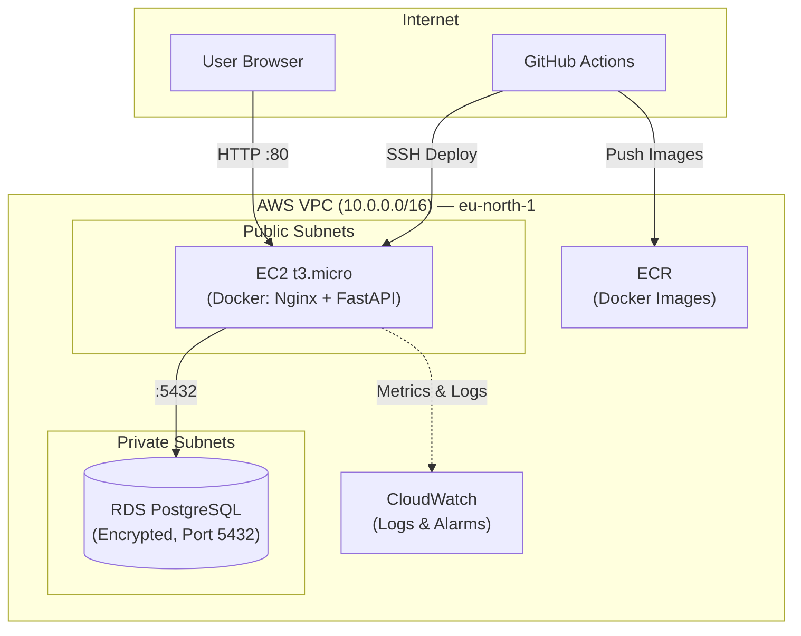

# 3-Tier Cloud Infrastructure — Mohamed Abouseada

[](https://github.com/mohamed-abouseada121/assessment-pi/actions)
[](https://www.terraform.io/)
[](https://aws.amazon.com/)
[](https://www.docker.com/)

A 3-tier web application deployed on AWS using Terraform, Docker, GitHub Actions CI/CD, and RDS PostgreSQL.

> **📝 Free Tier Note:** Deployed on a personal AWS account (`eu-north-1`) using only Free Tier–eligible resources (`t3.micro` EC2, `db.t3.micro` RDS). No unexpected charges are incurred. Infrastructure does not need to stay running after submission — screenshots and a live URL are provided as proof.

---

## Architecture



**Stack:**
- **Frontend** — Nginx serving a static HTML/CSS/JS page (runs as a Docker container on EC2)
- **Backend** — FastAPI (Python 3.12) serving `/health`, `/api/hr-message`, `/api/reactions`
- **Database** — Amazon RDS PostgreSQL 16 in private subnets (not publicly accessible)
- **Registry** — Amazon ECR with lifecycle rules (keeps last 3 images)
- **Monitoring** — CloudWatch Log Group + 2 Metric Alarms (CPU > 80%, Status Check Failed)

---

## Project Structure

```
├── .github/workflows/deploy.yml   # CI/CD pipeline
├── app/
│   ├── backend/
│   │   ├── Dockerfile             # Multi-stage, non-root user
│   │   ├── main.py                # FastAPI app
│   │   └── tests/test_main.py     # pytest unit tests
│   ├── frontend/
│   │   ├── Dockerfile             # Multi-stage Nginx
│   │   ├── index.html
│   │   ├── style.css
│   │   └── app.js
│   └── docker-compose.yml
└── terraform/
    ├── environments/prod/         # Root module (main.tf, variables.tf, outputs.tf)
    └── modules/
        ├── vpc/
        ├── security/
        ├── ec2/
        ├── rds/
        ├── ecr/
        └── monitoring/
```

---

## Run Locally

```bash
git clone https://github.com/mohamed-abouseada121/assessment-pi.git
cd assessment-pi/app
docker compose up --build -d
```

| Service | URL |
|---|---|
| Frontend | http://localhost |
| Backend API | http://localhost:8000/docs |
| Health Check | http://localhost/health |

**Run tests:**
```bash
cd app/backend
pip install -r requirements.txt
pytest tests/test_main.py
```

---

## Deploy to AWS (Terraform)

**Prerequisites:** AWS CLI configured, Terraform >= 1.5

```bash
cd terraform/environments/prod
cp terraform.tfvars.example terraform.tfvars
# Edit terraform.tfvars — set db_password

terraform init
terraform plan
terraform apply -auto-approve
```

After apply, Terraform prints:
- `application_url` — live app URL
- `ec2_public_ip` — server IP
- `rds_endpoint` — database address

---

## CI/CD Pipeline

Push to `main` triggers 3 stages automatically:

```
1. Unit Tests (pytest)
       ↓
2. Build & Push Docker Images to ECR
       ↓
3. SSH to EC2 → docker compose pull & up → Health Check
```

**Secrets are never hardcoded.** All credentials are stored in GitHub Repository Secrets:

| Secret | Purpose |
|---|---|
| `AWS_ACCESS_KEY_ID` / `AWS_SECRET_ACCESS_KEY` | AWS authentication |
| `DB_PASSWORD` / `DB_HOST` | RDS database credentials |
| `EC2_SSH_KEY` | SSH key for deployment |
| `EC2_HOST` | Server IP |

---

## Security

| Area | What was done |
|---|---|
| **Network** | RDS in private subnets, `publicly_accessible = false` |
| **Security Groups** | RDS only accepts connections from the EC2 Security Group on port 5432 |
| **IAM** | EC2 has a minimal IAM role: ECR read, CloudWatch write, SSM only |
| **Encryption** | RDS storage encrypted (KMS), EC2 EBS volume encrypted (KMS) |
| **Secrets** | No secrets in code — all in GitHub Secrets |

---

## Monitoring

- **CloudWatch Log Group** — `/aws/ec2/mado-cloud-prod`
- **Alarm 1** — CPU > 80% for 10 minutes → triggers alert
- **Alarm 2** — EC2 Status Check Failed → triggers alert immediately

---

## In Production (How This Would Scale)

| What | Assessment | Production |
|---|---|---|
| **Compute** | Single EC2 + Docker Compose | ECS Fargate or EKS behind an ALB with Auto Scaling |
| **Database** | Single-AZ RDS | Multi-AZ RDS with read replicas |
| **CDN / TLS** | Plain HTTP | CloudFront + AWS WAF + ACM certificates |
| **Secrets** | GitHub Secrets | AWS Secrets Manager with auto-rotation |

---

## Key Decisions

1. **EC2 + Docker Compose instead of ECS/EKS** — simpler, cheaper for assessment scope. Terraform modules are designed so the compute layer can be swapped later without changing VPC, RDS, or ECR.

2. **Managed RDS instead of a DB container** — automated backups, patching, and encryption handled by AWS. No operational overhead.

3. **Modular Terraform** — 6 separate modules (`vpc`, `security`, `ec2`, `rds`, `ecr`, `monitoring`), each independently reusable.
