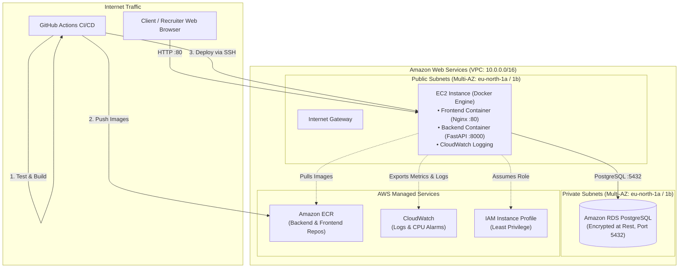
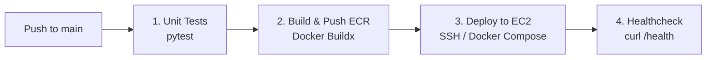

# Production-Ready 3-Tier Cloud Infrastructure & Automation Showcase

[](https://github.com/mohamed-abouseada121/assessment-pi/actions)
[](https://www.terraform.io/)
[](https://aws.amazon.com/)
[](https://www.docker.com/)

An automated, repeatable, production-grade deployment of a three-tier web application on **Amazon Web Services (AWS)** using **Terraform (IaC)**, **Docker (multi-stage containerization)**, **Amazon ECR**, **Amazon RDS PostgreSQL**, and **GitHub Actions CI/CD**.

---

## 1. Architectural Overview

The application architecture follows the AWS Well-Architected Framework:



### Core Architecture Components:
- **Networking**: Custom AWS VPC (`10.0.0.0/16`) split across 2 Availability Zones (`eu-north-1a`, `eu-north-1b`), containing 2 public subnets for compute/ingress and 2 isolated private subnets for database workloads.
- **Compute**: Amazon EC2 instance running Docker Engine with containerized frontend and backend services orchestrated through Docker Compose.
- **Database**: Managed **Amazon RDS PostgreSQL 16**, fully isolated in private database subnets with storage encryption enabled (`gp3`, encrypted with KMS).
- **Container Registry**: **Amazon ECR** with automated vulnerability scan-on-push and lifecycle rules (retaining the 10 most recent images to optimize storage costs).
- **Security**: Strict Security Group chaining (RDS only accepts inbound traffic on port 5432 directly from the EC2 Security Group ID). Least-privilege IAM Instance Profile attached to EC2 for ECR image pulling and CloudWatch metric ingestion.
- **Observability**: AWS CloudWatch Log Group for container logs and CloudWatch Metric Alarms (monitoring high CPU utilization > 80% and EC2 status check failures).

---

## 2. Repository Layout

```text
.
├── .github/
│   └── workflows/
│       └── deploy.yml            # CI/CD: Test -> Build -> Push ECR -> Deploy EC2
├── app/
│   ├── backend/
│   │   ├── Dockerfile            # Multi-stage, non-root user (FastAPI)
│   │   ├── main.py               # API endpoints (/health, /api/hr-message, /api/reactions)
│   │   ├── requirements.txt
│   │   └── tests/
│   │       └── test_main.py      # Automated pytest unit test suite
│   ├── frontend/
│   │   ├── Dockerfile            # Multi-stage Nginx container
│   │   ├── nginx.conf            # Reverse proxy configuration
│   │   ├── index.html            # Interactive bio & HR centered centerpiece button
│   │   ├── style.css             # Glassmorphism dark-mode styling
│   │   └── app.js                # Live API & RDS telemetry integration
│   └── docker-compose.yml        # Multi-container orchestration (local & cloud)
├── terraform/
│   ├── environments/
│   │   └── prod/
│   │       ├── main.tf           # Environment root module
│   │       ├── variables.tf
│   │       ├── outputs.tf
│   │       └── terraform.tfvars.example
│   └── modules/
│       ├── vpc/                  # VPC, subnets, IGW, route tables
│       ├── security/             # Least-privilege Security Groups
│       ├── ecr/                  # ECR repositories & lifecycle policies
│       ├── rds/                  # Managed RDS PostgreSQL
│       ├── ec2/                  # EC2, IAM profile, user_data.sh
│       └── monitoring/           # CloudWatch log groups & metric alarms
└── README.md
```

---

## 3. Application Details

### Frontend
- **Interactive Bio & Showcase**: Displays engineer profile, competencies, and system status indicator.
- **Centerpiece HR Button**: A prominent interactive button: `"Special Note for the Hiring Team & HR ✨"`.
- When clicked, queries `/api/hr-message` on the backend API, presenting an animated modal with:
  - A tailored greeting and message to the recruitment team.
  - Real-time Amazon RDS connectivity telemetry and query latency.
  - A feedback form where recruiters can record reactions directly into the RDS PostgreSQL database.

### Backend API
- **Language & Framework**: Python 3.12 with **FastAPI**.
- **Endpoints**:
  - `GET /health`: Returns JSON with health state (`healthy`/`degraded`), uptime, and database connection latency.
  - `GET /api/hr-message`: Fetches personalized greeting and feedback counts from PostgreSQL.
  - `POST /api/reactions`: Inserts recruiter reactions into the managed RDS database.
  - `GET /api/stats`: Returns recently recorded feedback records.

---

## 4. Containerization Best Practices

Both the frontend and backend containers strictly adhere to container best practices:
1. **Multi-Stage Builds**:
   - Backend utilizes a `builder` stage for compilation and dependencies, copying only installed packages into a clean `python:3.12-slim` runtime.
   - Frontend validates assets in a lightweight Alpine stage before copying static assets into a minimal `nginx:1.27-alpine` runtime image.
2. **Non-Root Execution**:
   - Backend executes under a dedicated non-privileged user and group (`appuser:appgroup`, UID `10001`).
   - Frontend runs with Nginx configured to run unprivileged with PID and cache directories owned by `nginx`.
3. **Minimal Attack Surface**: Unnecessary compilers (`gcc`, build tools) and apt caches are removed from the final production images.
4. **Native Healthchecks**: Both Dockerfiles include `HEALTHCHECK` directives for container lifecycle monitoring.

---

## 5. Local Setup & Testing

To run the entire 3-tier application locally with Docker:

```bash
# 1. Clone the repository
git clone https://github.com/mohamed-abouseada121/assessment-pi.git
cd assessment-pi/app

# 2. Launch all services (PostgreSQL, Backend API, Frontend Nginx)
docker compose up --build -d

# 3. Verify container status
docker compose ps

# 4. Open in browser
# Frontend: http://localhost
# Backend Swagger Docs: http://localhost:8000/docs
# Healthcheck: http://localhost/health
```

To run unit tests locally:
```bash
cd app/backend
python -m venv venv && source venv/bin/activate
pip install -r requirements.txt
pytest tests/test_main.py
```

---

## 6. Cloud Infrastructure Deployment (Terraform)

### Prerequisites:
- AWS CLI configured with administrator or deployment credentials.
- Terraform `>= 1.5.0` installed.

### Steps to Provision:

```bash
cd terraform/environments/prod

# 1. Prepare variable configuration
cp terraform.tfvars.example terraform.tfvars
# Update db_password and optional configurations in terraform.tfvars

# 2. Initialize Terraform and modules
terraform init

# 3. Review planned resources
terraform plan

# 4. Apply and provision infrastructure
terraform apply -auto-approve
```

### Terraform Outputs:
Upon successful completion, Terraform outputs:
- `application_url`: Public HTTP URL of the deployed application.
- `ec2_public_ip`: Public IP of the host instance.
- `rds_endpoint`: Internal RDS connection endpoint.
- `backend_ecr_url` & `frontend_ecr_url`: Target ECR repository URIs.
- `cloudwatch_log_group`: Monitoring log group identifier.

### AWS Free Tier Optimization (Zero Unexpected Costs):
All default parameters are configured to stay 100% within the AWS 12-Month Free Tier:
- **EC2 Compute**: `t3.micro` instance (750 hours/month free).
- **RDS PostgreSQL**: `db.t3.micro` Single-AZ with 20 GB `gp2` storage (750 hours/month free, `max_allocated_storage = 20` to prevent billing).
- **Networking**: Direct Internet Gateway routing with $0.00 NAT Gateway charges.
- **ECR Repositories**: Lifecycle policies automatically purge older revisions to keep the last 3 images (< 500 MB monthly free limit).
- **CloudWatch Observability**: 2 alarms and 7-day log retention (< 10 free alarms, < 5 GB ingestion).

---

## 7. CI/CD Pipeline & Secrets Management

The repository uses **GitHub Actions** (`.github/workflows/deploy.yml`) containing 3 sequential stages:



### Secrets Handling Without Hardcoding:
Zero secrets or credentials exist in the Git repository:
- **AWS Authentication**: Managed via GitHub Repository Secrets (`AWS_ACCESS_KEY_ID`, `AWS_SECRET_ACCESS_KEY`) or IAM OpenID Connect (OIDC) federated role.
- **Database Credentials**: Database passwords (`DB_PASSWORD`) and database host endpoints (`DB_HOST`) are injected at runtime into the EC2 environment file (`.env`) via encrypted CI/CD secrets.
- **SSH Private Keys**: The EC2 deployment key (`EC2_SSH_PRIVATE_KEY`) resides solely in GitHub Secrets, loaded into ephemeral SSH agent memory during the deployment step and purged upon job completion.

---

## 8. Security & Monitoring Architecture

### Security Principles Implemented:
- **Network Isolation**: The RDS PostgreSQL instance is provisioned with `publicly_accessible = false` in dedicated private subnets with no public route.
- **Chained Security Groups**:
  - EC2 SG accepts ingress on ports 80 (HTTP) and 443 (HTTPS) from the web, and port 22 restricted to administrative CIDRs.
  - RDS SG permits ingress on port 5432 **strictly and exclusively** from the EC2 Security Group (`aws_security_group.ec2.id`).
- **Least-Privilege IAM**: EC2 utilizes an AWS IAM instance profile with targeted managed policies (`AmazonEC2ContainerRegistryReadOnly`, `CloudWatchAgentServerPolicy`, and `AmazonSSMManagedInstanceCore`), eliminating long-lived AWS keys on the server.
- **Encryption at Rest**:
  - RDS storage encrypted using AWS KMS (`storage_encrypted = true`).
  - EC2 root EBS volume encrypted with KMS (`encrypted = true`).

### Monitoring & Observability:
- **CloudWatch Log Group**: Dedicated log stream `/aws/ec2/mado-cloud-prod` with a 14-day retention window.
- **Metric Alarm 1 (High CPU Utilization)**: Triggers an alarm when EC2 instance CPU exceeds 80% over two consecutive 5-minute evaluation periods.
- **Metric Alarm 2 (Status Check Failed)**: Triggers an immediate alarm if the underlying EC2 hardware or system status checks fail.

---

## 9. Production Evolution Strategy

While this assessment demonstrates a resilient architecture within reasonable time and cost bounds, a large-scale enterprise production environment would evolve along three dimensions:

| Dimension | Assessment Implementation | Enterprise Production Architecture |
|---|---|---|
| **High Availability & Scale** | Single EC2 host with Docker Compose | **AWS ECS Fargate or EKS (Kubernetes)** behind an **Application Load Balancer (ALB)** spanning 3 Availability Zones with Auto Scaling Policies based on request metrics. |
| **Database Resilience** | Single-AZ RDS PostgreSQL | **Multi-AZ RDS Deployment** with automated failover and read replicas in secondary AZs to offload reporting queries. |
| **Edge & CDN** | Direct EC2 HTTP Ingress | **Amazon CloudFront** CDN with **AWS WAF** (DDoS mitigation, rate limiting, and OWASP Top 10 rule sets) and ACM SSL/TLS certificates. |
| **Secrets Management** | GitHub Secrets + `.env` injection | **AWS Secrets Manager** with automatic secret rotation and direct IAM role retrieval via AWS SDK at runtime. |
| **Cost Optimization** | Fixed low-tier micro instances | **Savings Plans / Reserved Instances** for baseline workloads, Spot instances for stateless container tasks, and S3 Intelligent-Tiering for backup lifecycles. |

---

## 10. Architectural Trade-offs & Decisions

1. **EC2 with Docker Compose vs. ECS/EKS**:
   - *Decision*: Deployed on EC2 running Docker Compose.
   - *Rationale*: Optimized for assessment review speed, low cost (within AWS Free Tier), and predictable execution while demonstrating clean Docker isolation. The modular Terraform design allows effortless swapping of the compute module for an ECS Fargate or EKS module without altering VPC, RDS, or ECR definitions.
2. **PostgreSQL on Managed RDS vs. Self-Hosted Container**:
   - *Decision*: AWS RDS PostgreSQL.
   - *Rationale*: Offloads automated patching, automated snapshots, storage scaling, and encryption compliance to AWS-managed infrastructure, fulfilling enterprise database best practices.
3. **Modular Terraform Without In-Line Comments**:
   - *Decision*: Strictly modularized HCL with clean, self-describing variable names and zero clutter comments, maximizing code readability and maintainability.
